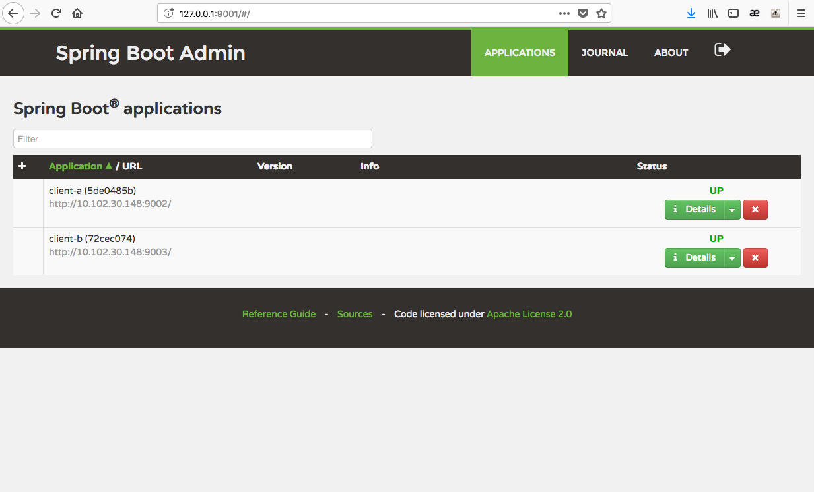

# Spring Boot Admin Sample

## What is Spring Boot Admin?

codecentric’s Spring Boot Admin is a community project to manage and monitor your __Spring Boot__ applications. The applications register with our Spring Boot Admin Client (via HTTP) or are discovered using Spring Cloud ® (e.g. Eureka, Consul). The UI is just an AngularJs application on top of the Spring Boot Actuator endpoints. via http://codecentric.github.io/spring-boot-admin/1.5.7/

## Project

- spring-boot-admin: Spring Boot Admin __Server__
- client-a, clinet-b: Spring Boot Admin __Client__

## Run

```
$ cd spring-boot-admin
$ ./mvnw spring-boot:run
```

```
$ cd client-a
$ ./mvnw spring-boot:run
```

```
$ cd client-b
$ ./mvnw spring-boot:run
```

## Check

Access http://localhost:9001 with a web browser. 

